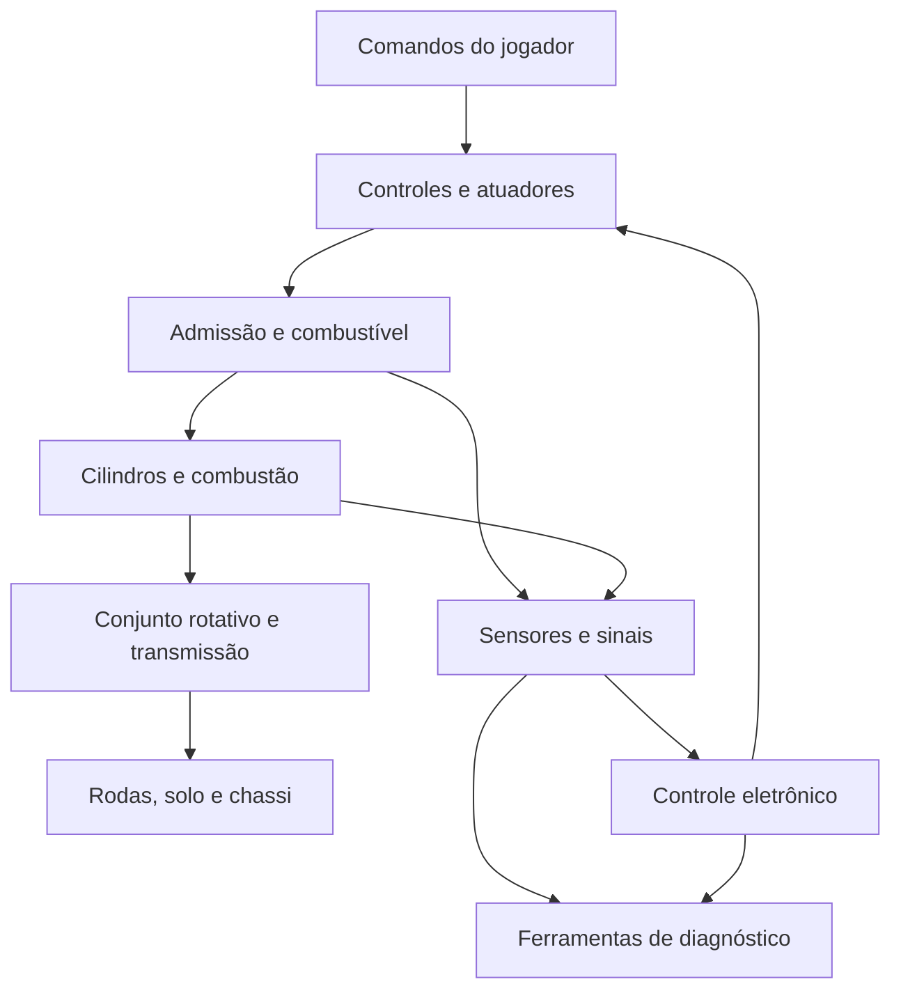

# Real Car Lifestyle

## Conceitos iniciais

**Autor da visão:** Alessandro Chiarelli Filho  
**Nome do jogo:** Real Car Lifestyle  
**Versão do documento:** 1.50 — economia de tokens e base reaproveitável  
**Data:** 11 de setembro de 2026  
**Fonte:** conversa fornecida pelo criador sobre o simulador existente e a proposta do jogo, complementada pelas atualizações nesta conversa.

**Distinção de projetos confirmada pelo criador:** o **Engine Data Flow** é o laboratório existente, em um projeto próprio no VS Code. O **Real Car Lifestyle** será desenvolvido em outro projeto e diretório no VS Code, ainda não criados. Outra IA poderá consultar o laboratório e aproveitar informações, código, padrões e gabaritos para construir o jogo nesse novo local.

> **Ideia central:** o veículo deve produzir movimento como consequência do funcionamento dos seus sistemas. O comando do jogador atua nesses sistemas; a resposta do carro depende do que está acontecendo dentro deles.

Este documento reúne e desenvolve, em linguagem organizada, tudo que foi explicado na conversa sobre o Real Car Lifestyle. Seu objetivo é preservar a visão do projeto para consultas futuras, discussão de requisitos e orientação de uma equipe ou de uma IA de desenvolvimento.

As afirmações sobre funcionalidades existentes registram o relato do criador e, quando indicado, a análise fornecida pela IA que atua no Engine Data Flow. Nenhum código, executável ou repositório do laboratório foi inspecionado diretamente para elaborar este documento. A visão completa do jogo, as funcionalidades relatadas como existentes e as questões ainda abertas aparecem identificadas ao longo do texto.

Os exemplos de funcionamento e de diagnóstico explicam consequências da proposta. Eles não acrescentam automaticamente novas funcionalidades ao escopo aprovado. Este documento também não escolhe motor gráfico, arquitetura, protocolos, fórmulas finais, cronograma ou MVP.

---

## Sumário

1. Visão geral do jogo
2. Origem e base já construída
3. Experiência pretendida para o jogador
4. Princípios fundamentais da simulação
5. Sistemas físicos presentes no veículo
6. Motor de combustão interna
7. Comando de válvulas e nomenclatura pendente
8. Admissão de ar e alimentação de combustível
9. Combustão e contribuição individual dos cilindros
10. Transmissão do esforço até o movimento do carro
11. Eletricidade, sensores, atuadores e controle
12. Chassi, suspensão e integração do veículo
13. Defeitos, quebras e efeitos sobre o funcionamento
14. Ferramentas profissionais de diagnóstico
15. Diagramas e consulta de informação técnica
16. Mundo aberto e atividades automobilísticas
17. Especialização e liberdade de atuação
18. Conhecimento, execução e imersão
19. Tempo real e profundidade da simulação
20. Fluxos ilustrativos de experiência
21. Inventário do que já foi definido
22. Decisões ainda em aberto
23. Continuidade da entrevista de requisitos
24. Orientações para desenvolvimento a partir deste documento
25. Glossário contextual
26. Texto consolidado de apresentação do projeto
27. Referência das falas e rastreabilidade

---

## 1. Visão geral do jogo

Real Car Lifestyle é a proposta de um jogo de mundo aberto centrado na vida automobilística. Seu projeto de implementação ainda não foi criado. O trabalho técnico existente pertence ao Engine Data Flow, laboratório de mecânica e simulação que servirá como fonte de conhecimento, código, padrões e gabaritos para o futuro jogo.

A experiência pretendida reúne atividades de condução, manutenção, diagnóstico, reparação, restauração, compra e venda de veículos, abertura de concessionárias, oficinas especializadas em uma marca, competição e outras formas de participação no universo automotivo. O jogador poderá escolher como deseja atuar nesse mundo.

A visão é proporcionar uma vida quase real em torno dos carros, incluindo a possibilidade de crescer financeiramente e se tornar dono de negócios automotivos. O jogador pode comprar vários veículos, consertá-los, revendê-los e, conforme acumula recursos, abrir concessionárias ou oficinas especializadas. Essa possibilidade amplia a vida profissional e comercial dentro do mesmo mundo.

O diferencial central é a profundidade funcional dos veículos. A mecânica, a eletricidade, os fluidos, o calor, os sensores e os atuadores precisam participar efetivamente do comportamento do carro. As ferramentas de oficina devem permitir investigar esse comportamento.

A ambição declarada é alcançar um nível de funcionamento automotivo incomum nos jogos e proporcionar a máxima imersão possível nessa vida automobilística. A expressão usada pelo criador, “nunca antes vista no mercado de jogos”, registra essa ambição; não representa uma comparação de mercado já pesquisada ou comprovada.

### 1.1 Referências de experiência citadas

| Referência mencionada | Aspecto que interessa ao projeto |
| --- | --- |
| Jogos no estilo Car Simulator | Participação em um mundo com veículos e atividades como comprar e vender carros. |
| Car Sales Simulator | Referência acrescentada pelo criador para a dimensão comercial: comprar, consertar e revender carros, acumular recursos e expandir para negócios automotivos, como concessionárias. |
| Car Mechanic Simulator e jogos semelhantes | Manutenção, reparação e restauração de veículos. |
| Jogos de corrida | Condução e competição automobilística. |
| Arrancada | Uma modalidade de atividade com os veículos. |
| Perseguição policial | Situações de perseguição dentro do mundo do jogo. |

Essas referências comunicam tipos de experiência. A linha de Car Sales Simulator registra a inspiração e o desenvolvimento desejados pelo criador para o Real Car Lifestyle; não constitui um inventário verificado das funcionalidades desse jogo. As referências não determinam que todos os sistemas, interfaces, economias ou modos dos jogos citados devam ser reproduzidos.

### 1.2 Relação entre simulador e jogo

O Engine Data Flow fornece materiais e referências técnicas para a proposta. Ele permanece como laboratório em seu próprio diretório. Outra IA poderá estudar seus resultados e aproveitar os componentes adequados ao construir o Real Car Lifestyle em um projeto separado.

No jogo, o mundo aberto deve permitir que os sistemas aproveitados sejam utilizados em diferentes contextos: um carro pode ser dirigido, apresentar um problema, passar por diagnóstico, receber um reparo, ser restaurado e voltar a circular. A forma de distribuir, adaptar ou integrar o código do laboratório ainda será definida; a separação entre os projetos já foi confirmada.

Essa continuidade é essencial para a visão: o comportamento que o jogador encontra na rua deve ter relação com aquilo que consegue observar e investigar na oficina.

## 2. Origem e base já construída

O trabalho existente se chama Engine Data Flow e é um projeto próprio no VS Code. O criador o define como laboratório para desenvolver físicas, padrões e gabaritos que deseja utilizar no Real Car Lifestyle. O laboratório também é descrito como um simulador de mecânica profissional que funciona no navegador.

A menção anterior ao Electron faz parte do histórico relatado do laboratório. A conversa descreve uma evolução conceitual: primeiro os fenômenos físicos, depois o motor e seus componentes, depois a representação integrada de um veículo. Essa trajetória não significa que o projeto do jogo já exista.

O papel exato do Electron no ambiente atual não foi detalhado. A análise posterior da IA do laboratório menciona arquivos TypeScript, React e Three.js, mas esses elementos ainda não foram inspecionados diretamente nesta documentação. Eles descrevem o ambiente relatado do laboratório e não constituem uma escolha de tecnologia para o jogo.

### 2.1 Evolução descrita

1. Representação de conceitos de eletricidade, calor, fluidos, ar e pneumática.
2. Construção de um motor com combustão interna, tempos de funcionamento e comando de válvulas.
3. Inclusão de componentes elétricos, sensores e atuadores associados ao motor.
4. Representação do conjunto em um chassi de carro com suspensão e outros componentes; a análise posterior da IA do laboratório informa que a dinâmica veicular sobre a pista ainda não existe.
5. Disponibilização de instrumentos de diagnóstico que permitem medir e interagir com o veículo.
6. Intenção de utilizar os resultados desse laboratório na construção de um jogo amplo de vida automobilística, em outro projeto.

### 2.2 Funcionalidades relatadas como existentes

| Área | Descrição fornecida pelo criador |
| --- | --- |
| Fenômenos físicos | Eletricidade, calor, movimentação de fluidos, ar e pneumática estão descritos no simulador. |
| Motor | Combustão interna, tempos do motor e comportamento do comando de válvulas já estão representados. |
| Sensores | Há sensores funcionais em tempo real; foram citados sonda lambda, detonação e rotação, entre outros. |
| Atuadores e componentes elétricos | O conjunto é descrito como amplo e funcional, integrado ao motor. |
| Veículo | O criador relatou um conjunto integrado com chassi e suspensão. A análise posterior da IA informa que faltam modelo de pneu, transferência de peso e suspensão reagindo à pista; é necessário distinguir a representação existente da dinâmica veicular ainda ausente. |
| Sistemas auxiliares | Foram mencionados marcador de combustível, bomba de pressão e válvula de cânister. |
| Multímetro | Ferramenta funcional para realizar medições. |
| Osciloscópio | Ferramenta funcional para observar sinais por meio de conexão aos pontos de interesse. |
| Scanner | Ferramenta que se comunica com os sistemas pelas redes correspondentes. |
| Consulta técnica | Existe uma referência a um sistema semelhante ao Doutor-IE para consultar diagramas elétricos. |

A afirmação de que há “todos os sensores” ou “todos os tipos de componentes” expressa a abrangência relatada. Ainda falta um inventário verificável que identifique exatamente quais componentes, variantes e comportamentos estão implementados.

### 2.3 Papel permanente do laboratório

O Engine Data Flow deve continuar sendo o local de estudo, experimentação e desenvolvimento das físicas, dos padrões e dos gabaritos. O trabalho já realizado e os desenvolvimentos futuros devem ser organizados de modo que outra IA consiga compreender e aproveitar os resultados no projeto do jogo.

| Projeto | Situação confirmada | Responsabilidade |
| --- | --- | --- |
| Engine Data Flow | Projeto existente no VS Code. | Desenvolver e demonstrar sistemas, reunir referências, validar comportamentos e fornecer materiais reutilizáveis. |
| Real Car Lifestyle | Projeto e diretório ainda não criados. | Implementar o jogo em outro local, aproveitando o que for adequado do laboratório. |

Preparar esse aproveitamento inclui documentar onde estão os componentes, como funcionam, suas entradas e saídas, dependências, unidades, limitações e formas de validação. Mudanças futuras devem manter essas informações atualizadas e facilitar a distinção entre lógica física, dados do veículo e apresentação do laboratório.

O código não precisa obrigatoriamente ser distribuído por um pacote, monorepositório ou outra solução específica. Esses mecanismos serão avaliados depois. O requisito confirmado é que os materiais possam ser compreendidos e aproveitados por outra IA em outro projeto.

### 2.4 Análise recebida da IA do Engine Data Flow

Foi fornecida uma análise da IA que trabalha no repositório. Ela identifica os seguintes materiais como candidatos a reaproveitamento. Os nomes abaixo foram citados nessa análise; seus conteúdos e testes ainda precisam ser apresentados como evidências.

| Material citado | Aproveitamento indicado pela IA | Distinção necessária |
| --- | --- | --- |
| Pasta `simulation` | Modelos de admissão, combustão, termodinâmica, cinemática, arrefecimento, lubrificação, turbo, emissões e amostragem de ciclo. | Inventariar equações, cobertura, aproximações, testes executados e dependências antes de afirmar prontidão para o jogo. |
| `valveTrain.ts` e `phasing.ts` | Investigar os estados do comando e a fasagem. | O código mostra o que foi implementado; sua correspondência física precisa ser explicitada. |
| `golfSensorHarness.ts` e `golfDevices.ts` | Topologia de componentes, condutores, vias, posições e destinos. | Demonstrar quais comportamentos elétricos e consumidores desse grafo já funcionam e quais ainda são propostas. |
| Representação do Golf V | Referência geométrica e funcional, com coordenadas descritas em milímetros. | Gabarito do laboratório; não é automaticamente arte final nem escolha aprovada do primeiro carro do jogo. |
| `caseStudies.pt-BR.ts`, `faults.pt-BR.ts` e `FAULT_MODEL.md` | Casos de diagnóstico e catálogo inicial de falhas. | Materiais candidatos a adaptação; missões e regras de falha do jogo ainda não estão concluídas. |
| `partsInventory.pt-BR.ts` | Referências de peças e aplicações. | Base candidata para conteúdo; não estabelece a economia ou a loja do jogo. |
| `multimeterHM2090.pt-BR.ts` e `courses.pt-BR.ts` | Instrumentação e conteúdo didático. | Conferir o que é descrição de conteúdo, comportamento executável e possível adaptação para o jogo. |

A mesma análise relata ausência de dinâmica veicular de condução, mundo aberto, trânsito, economia, missões, áudio e netcode. Também caracteriza o desempenho atual como de laboratório e a arte como geometria funcional. Essas informações refinam a leitura dos relatos anteriores, sem substituir uma inspeção técnica direta.

## 3. Experiência pretendida para o jogador

O jogador deverá poder construir sua experiência em torno das atividades automotivas que desejar. A visão permite alguém concentrado em dirigir e competir, alguém dedicado à manutenção geral e alguém que escolha um trabalho técnico bastante específico.

Um exemplo importante dado pelo criador é a possibilidade de ser apenas reparador de módulos. Outro é atuar com diagnóstico. Também foram citados o especialista em suspensão, o mecânico geral e outras formas de trabalho com veículos.

Isso exige profundidade suficiente em cada área: a especialização precisa corresponder a operações, problemas e conhecimentos que façam sentido dentro do jogo.

### 3.1 Liberdade pretendida

- Escolher as atividades automobilísticas que deseja realizar.
- Trabalhar com manutenção geral ou com uma especialidade.
- Utilizar ferramentas para investigar o estado dos veículos.
- Comprar, vender e restaurar carros.
- Acumular recursos comprando, consertando e revendendo vários veículos.
- Abrir concessionárias e atuar como dono de um negócio de venda de carros.
- Abrir oficinas mecânicas especializadas em uma determinada marca.
- Dirigir, correr, participar de arrancadas e encontrar situações de perseguição policial.
- Interagir com sistemas que tenham consequências efetivas no funcionamento do veículo.

### 3.2 Modos de entrada e opções

Ao abrir o jogo, há dois modos principais: **carreira/história (New Game)** e **laboratório**. Carreira e história foram usados para descrever a mesma entrada; o nome final ainda pode ser ajustado. Há também um menu de opções para configurar os comandos e binds.

O modo laboratório do Real Car Lifestyle é um ambiente jogável com todas as peças do jogo, onde se pode montar circuitos, experimentar e testar o funcionamento de montagens. Quatro pistas ficam ao redor desse laboratório: arrancada, drift, “trekking” e rali. O termo “trekking” foi preservado da resposta e precisa ser esclarecido antes de definir o tipo de pista.

Esse modo do jogo é distinto do **Engine Data Flow**, projeto externo onde as físicas, os padrões e os gabaritos são desenvolvidos. A inclusão de um laboratório jogável não altera a separação entre os dois projetos.

O laboratório jogável mantém a árvore de perks, mas permite configurar os níveis para testar apenas o que o jogador deseja ou usar um botão que coloca todos os perks no nível máximo. A resposta não determina que tudo já comece maximizado. O dinheiro é infinito, e a finalidade é criação e experimentação, sem precisar conquistar os recursos por meio da carreira.

Estado inicial dos perks, redução/reset de níveis e aplicação dos pré-requisitos na configuração ainda precisam ser definidos. A resposta 006 estabelece que nada criado no laboratório pode ser levado para a carreira, inclusive projetos de montagens.

Os elementos devem ser identificados com tags de origem por modo. Conteúdo criado no laboratório não pode ser carregado como parte da carreira nem renderizado nela. A finalidade do laboratório é testar e entender o jogo, preservando a carreira como experiência independente. O formato das tags e os mecanismos de verificação ainda serão implementados; esta é uma regra de produto confirmada.

Esse isolamento de conteúdo e estado do jogador não altera o aproveitamento de código e referências do projeto externo Engine Data Flow na construção do jogo.

### 3.3 Apresentação e recursos iniciais da carreira

Uma apresentação mostra que o personagem, um entusiasta de carros, saiu de uma cidade X para tentar uma vida nova em outra cidade. As cidades ainda serão escolhidas. Ele chega disposto a trabalhar, sem carro e com pouco dinheiro, insuficiente para comprar um veículo.

O tio o acolhe em sua casa. Na garagem há o carro do tio, no qual o jogador não mexe, e espaço para mais um carro, que o jogador poderá utilizar. Ele tem acesso a ferramentas muito básicas nessa garagem; não começa com uma oficina completa nem com um carro próprio para reparar.

A condição definida pelo criador substitui a sugestão anterior do entrevistador de começar com um carro usado defeituoso. A aquisição do primeiro carro deve fazer parte da progressão.

### 3.4 Trabalhos iniciais e apresentação das profissões

O jogador pode alugar uma bicicleta ou um carro para fazer entregas. O trabalho de pacotes envolve retirar vários volumes em um local e distribuí-los em diferentes pontos da cidade. Com um carro alugado, também pode fazer transporte de passageiros, descrito pelo criador como “Uber”, sem que isso determine integração oficial com uma plataforma real.

Comprar uma ECU, repará-la e revendê-la no mercado é apresentado como uma possibilidade profissional. Porém, faltam tanto as ferramentas necessárias quanto os perks exigidos para esse trabalho. O tutorial deve apresentar essas duas limitações e explicar os requisitos para exercer profissões específicas. Ter conhecimento e ferramentas não dispensa o perk requerido para o reparo.

O valor inicial, os preços e condições dos aluguéis, os pagamentos e a lista exata de ferramentas ainda não foram definidos.

### 3.5 Conquista e uso do primeiro carro

Ao juntar dinheiro com o trabalho, o jogador poderá procurar um veículo no ferro-velho ou em leilão. Esses dois locais foram definidos como os únicos canais para adquirir um carro já quebrado. Carros novos e usados funcionando também podem ser comprados, mas a opção inicialmente acessível será um usado velho com defeito.

O carro vem com um problema aleatório que o jogador não conhece completamente antes de comprar. Alguns vendedores permitem testes simples. A investigação prévia é limitada tanto pela autorização do vendedor quanto pelas ferramentas disponíveis. Ainda será necessário especificar o momento de geração do defeito, as informações de venda e os testes permitidos.

Quando o carro próprio estiver em condição de uso, ele permitirá trabalhar com entregas ou passageiros sem continuar pagando aluguel de veículo. Sua conquista também abre caminho para participar de eventos e encontros de carros.

### 3.6 Encontros, contatos e perks de carreira

Nos eventos, o jogador conhece pessoas que o inserem na cultura automobilística e no mercado. Os contatos feitos no primeiro encontro orientam sua escolha de carreira inicial. Essa especialização não é definitiva: ele pode mudar de carreira.

Cada carreira possui perks que liberam coisas e habilidades. O criador confirmou na resposta 002 que o perk necessário é requisito para executar um reparo de ECU, mesmo que o jogador já conheça o procedimento e tenha as ferramentas. O tutorial apresenta os requisitos de equipamento e progressão.

Os nichos citados incluem corrida, rali, arrancada, pilotagem de automobilismo, dono de loja, reparo em oficina, dono de oficina e “vendedor de oficina”. A expressão foi preservada e sua função específica ainda será detalhada. Os perks também podem permitir a progressão até proprietário de um negócio. Outra possibilidade é atuar como autônomo comprando, reparando e revendendo carros.

A resposta 009 atualiza as possibilidades iniciais: o primeiro perk, Mão na Massa, é obtido diretamente no tutorial e libera desmanche de peças, borracheiro e auxiliar de mecânico. Entregas com moto de 50 cc alugada por baixo custo diário formam o outro grupo básico de trabalho, desde que haja dinheiro para o aluguel. Esses trabalhos geram renda e experiência para progredir. A resposta 003 confirma que a progressão nas entregas pode permitir desbloquear o primeiro perk de reparação. Os desbloqueios são organizados em árvores de habilidades e exigem investimento de dinheiro e pontos de habilidade. A conversão de experiência em pontos e os requisitos de cada perk ainda serão detalhados. A resposta 004 confirma a evolução simultânea, incluindo pré-requisitos cruzados entre árvores.

### 3.7 Regras ainda abertas

Persistência dentro de cada modo e mecanismos de isolamento entre eles, detalhes da configuração do laboratório jogável, significado da pista “trekking”, equipamentos exatos, valores iniciais, detalhes do tutorial, aluguéis, inspeções e regras de perks ainda serão detalhados. A estrutura geral dos dois modos e do começo da carreira já está confirmada.

### 3.8 Tempo do jogo, sono e experiência

O jogo terá tempo acelerado, dia e noite e um relógio visível indicando o horário. GTA foi citado como referência para essa passagem de tempo. A duração exata do dia e a correspondência entre minutos reais e tempo simulado ainda não foram definidas.

A experiência é concedida ao final do dia, quando o personagem dorme, com base no que realizou naquele dia, incluindo reparos bem-sucedidos e tentativas que dão errado. Haverá um fechamento ou registro dessas atividades, cujo formato ainda precisa ser especificado. Não foram definidas regras para noites sem dormir, duração do sono ou repetição do fechamento.

O dinheiro é recebido em tempo real conforme as transações acontecem. Portanto, experiência diária e movimentação financeira possuem momentos distintos. O criador confirmou o uso de pontos de habilidade e dinheiro para abrir perks e a possibilidade de alcançar outra área a partir dos trabalhos iniciais. A conversão da experiência em pontos, os custos e os pré-requisitos ainda estão em discussão.

## 4. Princípios fundamentais da simulação

### 4.1 Movimento como resultado do funcionamento

A tecla ou o controle de aceleração deve produzir uma solicitação ao veículo. Para que o carro se mova pela própria propulsão, seus sistemas precisam responder a essa solicitação e produzir esforço que alcance as rodas e seja transmitido ao solo.

A descrição do criador enfatiza a continuidade desse processo: entrada de ar e combustível, funcionamento do motor, contribuição dos cilindros, transmissão e contato das rodas com o chão.

### 4.2 Causalidade entre sistemas

O estado de um componente pode afetar outros componentes. Uma alteração na alimentação do motor precisa ter consequências compatíveis no funcionamento; uma falha no caminho de transmissão do esforço precisa interferir no que chega às rodas.

Isso faz da simulação um conjunto de sistemas conectados. A mecânica observada pelo jogador depende dessas conexões.

### 4.3 Medições ligadas ao estado simulado

As ferramentas devem observar grandezas e sinais relacionados ao que está acontecendo no veículo. O diagnóstico ganha sentido quando a leitura de um instrumento, a ação de um componente e o comportamento do carro pertencem ao mesmo processo.

### 4.4 Falhas com consequências funcionais

O criador estabelece que qualquer parte da cadeia pode quebrar e que o veículo pode deixar de funcionar por causa dessas quebras. A presença de uma falha precisa alterar o sistema envolvido.

O catálogo de falhas, seus graus de severidade, causas e formas de reparo ainda será detalhado. Uma falha poderá afetar apenas uma função ou comprometer o conjunto, conforme o componente e a condição envolvidos.

### 4.5 Conhecimento aplicado por meio de ações

O jogador deve executar procedimentos e utilizar instrumentos. A competência técnica terá valor porque a interação com o veículo exige compreender o problema e agir sobre ele.

### 4.6 Resposta contínua em tempo real

O criador pede que os cálculos e suas consequências aconteçam em milissegundos, permitindo que o carro funcione enquanto é conduzido ou examinado. O orçamento de desempenho e as frequências exatas de cálculo ainda não foram definidos.

## 5. Sistemas físicos presentes no veículo

A base do simulador foi descrita a partir do entendimento de que um carro movimenta e transforma diferentes formas de matéria e energia. Esses fenômenos são parte do funcionamento pretendido.

| Domínio | Elementos explicitamente mencionados | Papel na visão |
| --- | --- | --- |
| Eletricidade | Componentes elétricos, sensores, atuadores e instrumentos | Permitir funcionamento elétrico e diagnóstico correspondente. |
| Calor | Movimentação de calor no veículo | Incluir o comportamento térmico na representação dos sistemas. |
| Óleo | Circulação de óleo | Representar esse fluido como parte funcional do conjunto. |
| Fluido de freio | Movimentação do fluido | Integrar o domínio hidráulico do veículo. |
| Água | Circulação de água | Representar o fluido citado nos sistemas do carro. |
| Ar e pneumática | Movimentação de ar, especialmente na admissão | Fazer o fluxo de ar participar efetivamente do funcionamento. |
| Combustível | Circulação, alimentação e admissão de combustível | Alimentar o processo que permite a combustão. |
| Mecânica | Pistões, comando, transmissão, suspensão e rodas | Relacionar funcionamento dos componentes, esforços e movimento. |

Na fala do criador, os fluidos devem ocorrer e circular “naturalmente”. Aqui isso é registrado como a exigência de um comportamento que resulte das condições do sistema. A conversa ainda não especifica quais equações ou aproximações representam cada fluido.

### 5.1 Profundidade diferente de simples presença visual

O ar mencionado na admissão precisa afetar o funcionamento do motor. O combustível precisa participar da mistura e da combustão. Os sinais elétricos precisam ter relação com os componentes e com as medições.

Os detalhes de representação visual — cortes, transparências, animações de fluxo, cores ou visualização de partículas — não foram definidos. A exigência formulada é principalmente funcional.

### 5.2 Acoplamento entre domínios

A proposta conecta eletricidade, fluidos, mecânica e calor no mesmo veículo. Como consequência conceitual, um componente elétrico que altera o funcionamento de um atuador pode modificar uma condição física, e essa condição pode ser percebida por sensores.

O alcance de cada acoplamento depende do modelo de veículo e dos componentes que vierem a ser especificados. Este documento não presume que todas as interações possíveis já estejam implementadas.

## 6. Motor de combustão interna

O motor é o núcleo mais detalhado da explicação do projeto. Ele deve representar o processo de combustão e a participação dos componentes que tornam esse processo possível.

O criador destaca os tempos do motor, o movimento do pistão, a abertura e o fechamento das válvulas, o comando de válvulas, a centelha e a contribuição de cada cilindro para o esforço produzido.

### 6.1 Elementos centrais citados

- Admissão de ar e combustível.
- Movimento do pistão ao longo do funcionamento.
- Compressão da carga no cilindro.
- Centelha e combustão.
- Estado das válvulas de admissão e de escape.
- Relação entre comando de válvulas e fase de funcionamento do cilindro.
- Produção de esforço por cada cilindro.
- Participação conjunta dos cilindros no funcionamento do motor.

Essa descrição constitui o modelo conceitual desejado. A correspondência exata entre posições angulares, eventos de válvula, ignição e estados nomeados precisa ser documentada a partir da implementação existente.

### 6.2 Motor inicial e ampliação de variáveis

Para explicar a ideia, o criador utiliza um motor simples, sem modificações. Ele também indica que outras variáveis entrarão ao longo do jogo.

Isso estabelece uma intenção de ampliar a complexidade representada, mas não define uma lista de preparações, peças, combustíveis, sobrealimentação, métodos de acerto ou regras de desbloqueio. Esses detalhes continuam em aberto.

### 6.3 Motor como sistema observável

O funcionamento deve poder ser acompanhado pelos sensores e pelas ferramentas disponíveis. O que ocorre dentro do conjunto precisa produzir efeitos que façam sentido para quem está dirigindo, medindo um sinal ou investigando um defeito.

## 7. Comando de válvulas e nomenclatura pendente

O comando de válvulas foi destacado como uma parte fundamental do simulador existente. O criador utiliza os termos **balanço**, **admissão**, **escape** e **cruzamento** ao descrever posições ou condições do comando e das válvulas.

Depois da primeira explicação, ele corrigiu a própria lembrança da sequência e afirmou que balanço e cruzamento são posições distintas dentro da representação que estava descrevendo. Também disse que precisava verificar a ordem exata e pediu que a discussão fosse retomada posteriormente.

### 7.1 O que deve ser preservado

1. O comportamento do comando é importante para a fidelidade pretendida.
2. A posição das válvulas precisa se relacionar com o funcionamento do cilindro.
3. O criador relata que essa representação já está descrita e funcional no simulador.
4. A terminologia e a sequência exata ficaram explicitamente pendentes de verificação.

### 7.2 O que não pode ser tratado como especificação fechada

Não há base suficiente na conversa para aprovar uma sequência técnica definitiva chamada “balanço → centelha → escape → cruzamento”. Essa lembrança foi apresentada com incerteza pelo próprio criador.

Também não se deve transformar os nomes mencionados em uma nova lista de tempos termodinâmicos do motor. As expressões usadas para posição de cames, estado de válvulas e fase do ciclo precisam ser distinguidas durante a revisão.

### 7.3 Verificação futura necessária

| Item a conferir | Resultado esperado da revisão |
| --- | --- |
| Significado de “balanço” no simulador | Descrição exata da posição e do estado associados ao nome. |
| Significado de “cruzamento” no simulador | Descrição exata da posição e do estado associados ao nome. |
| Posição dos cames | Relação entre a geometria representada e a atuação nas válvulas. |
| Posição do pistão e do virabrequim | Correspondência com o estado mostrado para o cilindro. |
| Abertura e fechamento de válvulas | Eventos efetivamente implementados e sua sequência. |
| Centelha e combustão | Relação temporal com os demais eventos. |

Até essa revisão, o requisito é preservar o funcionamento relatado e documentar corretamente sua correspondência física. Este documento não valida a nomenclatura disputada nem redefine a implementação.

A IA do Engine Data Flow aponta `valveTrain.ts` e `phasing.ts` como fontes para essa revisão. A próxima análise deve relacionar trechos do código a ângulos do virabrequim e do comando, posição do pistão, abertura das válvulas e evento de ignição. A existência desses arquivos, por si só, não encerra a pendência terminológica.

## 8. Admissão de ar e alimentação de combustível

O criador dá ênfase especial ao ar: precisa haver simulação da sua passagem pelo conjunto de admissão, e a quantidade admitida deve participar dos cálculos do motor.

O combustível também deve circular, ser admitido conforme o sistema representado e participar da mistura envolvida na combustão. A relação entre o que entra no motor e o que ele produz precisa ser calculada continuamente.

### 8.1 Informações que a visão exige representar

| Informação | Por que interessa ao projeto |
| --- | --- |
| Quantidade de ar admitida | É uma das condições usadas para determinar o funcionamento do cilindro. |
| Quantidade de combustível admitida | Participa da condição de mistura e da combustão. |
| Condição de admissão | Relaciona o caminho de entrada ao estado efetivo do motor. |
| Condição de alimentação | Relaciona o fornecimento de combustível ao que chega ao processo de combustão. |
| Estado das válvulas | Vincula a entrada e a saída ao momento de funcionamento do cilindro. |
| Estado dos componentes envolvidos | Permite que funcionamento e falha tenham consequências. |

As unidades usadas para representar essas grandezas, sua resolução temporal e os modelos matemáticos correspondentes ainda não foram escolhidos na conversa.

### 8.2 Aceleração e resposta do conjunto

A solicitação de aceleração deve atuar sobre o sistema de controle do veículo representado. A resposta depende das condições de admissão, alimentação, motor e transmissão.

O caminho exato entre pedal, acionamento mecânico ou eletrônico, controle da admissão e injeção não foi especificado por modelo de carro. Não se deve presumir uma única configuração para todos os veículos futuros.

### 8.3 Componentes de combustível citados

O criador menciona bomba de pressão, marcador de combustível e válvula de cânister como exemplos de componentes já presentes na descrição funcional do carro. Tipo de bomba, valores de pressão, estratégias de controle e variantes do sistema não foram detalhados.

## 9. Combustão e contribuição individual dos cilindros

A explicação estabelece que cada cilindro deve contribuir individualmente para o esforço produzido pelo motor. Essa contribuição deve depender do que está acontecendo naquele cilindro no momento considerado.

As variáveis explicitamente citadas são a quantidade de ar, a quantidade de combustível e a taxa de compressão. O criador também menciona que outras variáveis participarão da equação, sem fornecer uma lista completa ou uma fórmula.

### 9.1 Requisito conceitual por cilindro

1. Considerar a condição de admissão e alimentação relevante para aquele cilindro.
2. Relacioná-la ao estado de funcionamento e à compressão.
3. Representar a combustão e seu efeito mecânico.
4. Obter a contribuição instantânea do cilindro para o funcionamento do motor.
5. Combinar essa contribuição com as dos demais cilindros de forma coerente com suas fases.

### 9.2 Precisão de linguagem: força, torque e energia

Na fala original, a expressão “input de força” é usada para comunicar a contribuição do cilindro. Para desenvolver o modelo, será necessário distinguir a força aplicada ao pistão, o torque no eixo e a energia transferida entre componentes.

A pressão resultante no cilindro atua sobre o pistão. A geometria do mecanismo participa da conversão desse esforço em torque no virabrequim. As contribuições dos cilindros ocorrem em fases diferentes e precisam ser combinadas respeitando essa relação.

Essa explicação organiza o sentido físico da ideia. Ela não escolhe um modelo de combustão ou uma implementação numérica específica.

### 9.3 Resultado conjunto do motor

O criador deseja um resultado instantâneo que expresse o esforço que o motor está transmitindo ao conjunto seguinte. Essa saída precisa refletir o estado dos cilindros e dos componentes envolvidos.

Ao especificar as equações, será necessário considerar a contribuição dos cilindros, as cargas aplicadas ao motor, as perdas e a inércia do conjunto. A conversa não determinou quais desses efeitos já estão modelados nem seu nível de detalhe.

### 9.4 Consequência para a individualidade dos cilindros

Se o modelo distingue a contribuição de cada cilindro, uma alteração em um deles pode mudar o comportamento global. Isso dá sustentação ao objetivo de diagnosticar problemas a partir do funcionamento real do sistema.

Não foi definido um número obrigatório de cilindros nem uma arquitetura inicial específica. Configurações de motor devem ser escolhidas em uma etapa posterior.

## 10. Transmissão do esforço até o movimento do carro

O movimento do veículo deve resultar da continuidade entre o funcionamento do motor e o contato das rodas com o solo. O criador explica que a roda empurra o chão e que a reação do chão movimenta o carro.

A descrição menciona volante, embreagem e câmbio. A expressão “volante de direção” aparece durante essa explicação oral, junto de “volante de embreagem”. Para descrever o caminho de propulsão, este documento usa **volante do motor**; o volante de direção pertence ao sistema de direção.

### 10.1 Etapas funcionais

| Etapa | Papel no conceito |
| --- | --- |
| Cilindros | Produzir contribuições mecânicas a partir das condições de funcionamento. |
| Virabrequim | Reunir as contribuições em um sistema rotativo. |
| Volante do motor | Participar da dinâmica rotacional e da inércia do conjunto. |
| Acoplamento à transmissão | Transferir esforço conforme a configuração e o estado do sistema. |
| Câmbio | Relacionar torque e rotação conforme o mecanismo e a relação utilizados. |
| Transmissão final | Levar esforço às rodas conforme a configuração do veículo. |
| Rodas e pneus | Interagir com o solo e produzir as forças externas correspondentes. |
| Chassi | Responder ao conjunto de forças que atua sobre o veículo. |

As etapas intermediárias completam a explicação física do caminho descrito. A existência de diferenciais, semi-eixos ou outras peças específicas em cada configuração ainda precisa constar do inventário técnico do veículo.

### 10.2 Vários tipos de câmbio

O criador prevê diferentes tipos de câmbio no jogo. Não foram listados os tipos, seus mecanismos, modos de controle ou a ordem de implementação.

O requisito confirmado é que o sistema de transmissão escolhido tenha participação real na relação entre o motor e o movimento das rodas.

### 10.3 Conservação e transformação

A fala original usa “conservar a força” para enfatizar que o resultado produzido no motor precisa seguir pela cadeia mecânica. Na especificação física, isso deverá ser descrito em termos de transferência de energia, transformação de torque e rotação, perdas e armazenamento temporário de energia no conjunto.

Uma relação de transmissão modifica torque e velocidade angular. Portanto, o documento não estabelece que o mesmo valor numérico de força ou torque atravessa todos os componentes sem transformação.

### 10.4 Integração da cadeia mecânica e eletrônica

O diagrama abaixo representa relações funcionais da visão. Não define módulos de software ou uma arquitetura já aprovada.

Os caminhos de controle e de diagnóstico variam conforme o veículo e o sistema simulado. O diagrama mostra a ligação entre estado físico, sinal, controle e comportamento; não presume que cada sensor tenha exatamente essas conexões em todo carro.

## 11. Eletricidade, sensores, atuadores e controle

O componente elétrico foi descrito como completo e integrado ao motor. O criador afirma que os sensores e atuadores estão descritos e funcionais em tempo real.

Entre os exemplos explícitos estão sensores de escapamento, sonda lambda, sensor de detonação e sensor de rotação. A conversa também aborda o reparo de módulos como uma atividade desejada no jogo.

### 11.1 Sensores

Os sensores devem ter relação com o estado do sistema que representam. Seus sinais precisam fazer sentido para os componentes que os utilizam e para as ferramentas capazes de observá-los.

O catálogo, os sinais, as faixas, os conectores, as curvas e os modos de falha de cada sensor ainda precisam ser documentados por componente.

### 11.2 Atuadores

Os atuadores devem produzir efeitos no sistema em que trabalham. A válvula de cânister e a bomba mencionadas pelo criador exemplificam a abrangência pretendida para o conjunto funcional.

Ainda não existe, nesta conversa, uma lista fechada de atuadores nem a descrição das condições de acionamento de cada um.

### 11.3 Módulos e controle eletrônico

A interação entre sensores, decisões de controle e atuação aparece na conversa como parte da explicação de causalidade. A profundidade interna dos módulos ainda não foi definida.

A possibilidade de atuar como reparador de módulos torna necessária uma futura decisão sobre o que será acessível ao jogador: componentes, circuitos, medições e operações de reparação. Nenhum desses detalhes deve ser presumido como escopo aprovado apenas pela menção à profissão.

### 11.4 Redes de comunicação

O criador afirma que o scanner se comunica pelas redes corretas. Isso deve ser preservado como requisito de coerência entre o veículo, seus sistemas e o instrumento.

A conversa não identifica protocolos, barramentos, endereços, serviços ou formatos de mensagens. Também não define comunicação com equipamentos físicos externos. Esses elementos permanecem abertos.

## 12. Chassi, suspensão e integração do veículo

O criador relatou ter integrado a simulação do motor a uma representação de carro com chassi, suspensão e outros componentes. A análise posterior da IA do Engine Data Flow identifica esse conjunto como um gabarito funcional e geométrico do Golf V e informa que a dinâmica veicular de condução ainda não foi implementada.

Portanto, o relato anterior de suspensão funcional não deve ser interpretado como comprovação de um modelo de pneu, transferência de peso ou suspensão reagindo à pista. É preciso documentar exatamente quais movimentos e interações já estão presentes no laboratório.

Essa integração amplia a finalidade da base: os efeitos produzidos pelo conjunto mecânico precisam se manifestar no carro completo, e a atuação do jogador em diferentes sistemas precisa ter sentido dentro desse mesmo veículo.

### 12.1 Suspensão como área de atuação

A suspensão aparece tanto como parte funcional do carro quanto como possibilidade de especialização profissional do jogador. O nível de desmontagem, ajuste, medição, defeitos e reparos ainda não foi especificado.

### 12.2 Indicadores e componentes auxiliares

O marcador de combustível é citado entre os elementos existentes. Sua presença reforça a intenção de que o veículo possua funções além do motor e da movimentação básica.

Ainda será necessário identificar quais indicadores dependem de quais sensores e módulos, e como seus defeitos serão representados. Essa documentação é uma consequência futura da abrangência pretendida.

### 12.3 Configuração de cada veículo

O laboratório utiliza o Golf V, conforme a análise de sua IA. Isso não define a seleção de veículos do jogo: modelos, marcas, dimensões, plataformas, suspensões e configurações de tração do Real Car Lifestyle ainda precisam ser escolhidos. As coordenadas em milímetros relatadas no laboratório devem ter sua referência e validação documentadas.

## 13. Defeitos, quebras e efeitos sobre o funcionamento

O projeto exige que problemas nos componentes tenham consequências efetivas. O criador enfatiza que uma parte d
## Esclarecimento da resposta 028 — Homologação e comércio

A peça exibe explicitamente a característica “homologada” ou “não homologada”, tanto na internet quanto na compra presencial. O desmanche comum pode pagar taxas para homologar ou vender sem homologação por menos; alguns clientes não aceitam peças não homologadas. No jogo, peças homologadas são mais caras, mais confiáveis e menos propensas a falhas, sem garantia de falha zero. O jogador pode ter seu próprio desmanche. Também foi confirmada a possibilidade de roubar coisas, com mecânicas e consequências ainda a desenvolver. Não se presume que toda peça não homologada seja roubada. A forma de exibir a condição mecânica detalhada e a procedência permanece aberta.

## Esclarecimento da resposta 029 — Gestão do negócio

O dono é responsável por toda a operação e gestão do negócio, incluindo comprar, vender e pagar impostos. Pode contratar um gerente para delegar a gestão. Salário, autonomia, decisões que exigem autorização e funcionamento do negócio na ausência do jogador ainda não foram definidos.

## Esclarecimento da resposta 030 — Dívidas e morte

Na inadimplência, o banco toma os bens do personagem, com exceção da casa, e ele pode permanecer com saldo negativo. Não foi definido que a tomada de bens quite a dívida ou encerre automaticamente a carreira. Se o personagem morrer, não há respawn. A resposta 031 define a exceção Efeito Borboleta, descrita abaixo.

## Esclarecimento da resposta 031 — Efeito Borboleta

A morte encerra definitivamente a campanha, com a exceção do item Efeito Borboleta. Ele só pode ser comprado uma vez por campanha. A compra estabelece automaticamente o ponto de retorno: caso o personagem morra, volta ao momento exato em que comprou o item. Não há autorização para carregar livremente um salvamento anterior após morrer. O Efeito Borboleta é de uso único: perde o efeito após o primeiro retorno. Como a compra também é limitada a uma vez por campanha, uma morte posterior encerra definitivamente essa campanha. O criador reforçou que a entrevista deve avançar para decisões maiores, evitando insistência em detalhes já suficientemente explicados.

## Esclarecimento da resposta 033 — Carreira aberta e continuidade

A premissa é uma carreira aberta de vida automobilística: o jogador constrói sua trajetória até os perks finais de cada caminho, interagindo com NPCs da própria carreira e de outras e combinando carreiras. A pergunta 033 retomou desnecessariamente uma premissa já explicada; a entrevista deve aproveitar as decisões anteriores e avançar apenas sobre lacunas relevantes.

Conquistar um campeonato ou chegar ao topo de uma árvore não encerra automaticamente a campanha. Os campeonatos continuam acontecendo, os carros podem quebrar e o jogador pode continuar trabalhando, mantendo os veículos e acumulando dinheiro para comprar carros cada vez mais caros. O “fim” por realização de objetivos é subjetivo: quando o jogador considerar que não tem mais o que fazer. Isso permanece distinto da morte definitiva já estabelecida.

O criador pretende continuar atualizando o jogo com novos eventos e veículos, incluindo carros cada vez mais caros. Frequência, quantidade e modelo de distribuição dessas atualizações não foram definidos.

**Continuidade da entrevista:** partes 1 a 4 relidas integralmente por solicitação do criador; parte 5 aberta com a pergunta 034. A resposta 034 confirma adaptações condicionadas ao encaixe, funcionamento e comunicação. Solda e placas de metal foram confirmadas na resposta 035; controles e limites técnicos permanecem pendentes.

## Esclarecimento da resposta 034 — Adaptações

Adaptações entre componentes e projetos modificados são possíveis desde que as peças se encaixem, funcionem e se comuniquem. Essa liberdade não significa compatibilidade automática de qualquer combinação. O criador exemplifica projetos com menos eletrônica e alguns sensores desligados: o motor pode funcionar com risco constante de quebra, e esses projetos não conseguem ser legalizados. Isso não torna toda adaptação impossível de legalizar nem estabelece que qualquer sensor possa ser desligado sem impedir o funcionamento. Solda e placas de metal foram confirmadas na resposta 035; controles e limites técnicos ainda não foram detalhados.

## Esclarecimento da resposta 035 — Fabricação

O jogador terá solda e placas de metal para confeccionar junções e fabricar ou adaptar partes como chassi e escapamento. A intenção é ampla liberdade de criação, mantendo os requisitos já definidos de encaixe, funcionamento e comunicação entre componentes. Tipos de solda, modelagem das placas e controles de execução ainda não foram definidos.

## Esclarecimento da resposta 036 — Danos e reparação

Haverá danos envolvendo lataria e chassi, serviços de funilaria e possibilidade de PT (perda total), com a vida real como referência. O criador deixou o detalhamento desse sistema para desenvolvimento posterior. Não foram definidos critérios de perda total, modelo de deformação, reparabilidade, seguro ou indenização; a menção a PT não confirma automaticamente esses mecanismos.

## Esclarecimento da resposta 037 — Imóveis

Os imóveis terão um sistema básico de pré-construções. O jogador poderá personalizar esses espaços adicionando móveis e utilidades comprados separadamente em lojas de móveis e de utilidades. A resposta não detalha edição estrutural dos imóveis ou controles de posicionamento.

## Esclarecimento da resposta 038 — Simuladores de reparo

Cada tipo de reparo terá uma simulação própria, com a interação adequada à tarefa. Ao iniciar uma solda, abre-se uma interface específica que simula a situação real de soldagem. Ações como mexer em parafusos e conectar fios podem acontecer no POV normal, usando uma ação ou ferramenta e “semi-interfaces”, conforme a expressão do criador. Portanto, nem todo reparo exige uma interface separada. Controles específicos e parâmetros de cada simulador ainda serão desenvolvidos.

## Esclarecimento da resposta 039 — Interação com NPCs

Ao se aproximar de um NPC, o jogador terá uma roda inicial de ações ou vertentes de diálogo, como conversa, venda, compra e serviço. Selecionar uma vertente inicia um diálogo que avança pelas opções disponíveis para o jogador e o NPC naquele contexto, incluindo a situação de uma missão. O fluxo e as opções variam conforme o momento. Uma roda com seis vertentes foi exemplificada; a lista completa e a quantidade definitiva ainda não foram fechadas.

## Esclarecimento da resposta 040 — Preços e qualidade

Os preços serão padrão, baseados na vida real. Cada peça terá parâmetros próprios de material, fabricação e qualidade que fundamentam seu preço. Pistões e bielas forjados, material do cabeçote (como ferro fundido) e material do escapamento foram citados como exemplos. Não foi solicitado um sistema de mercado dinâmico. O criador voltou a rejeitar perguntas óbvias ou que exijam repetir premissas; a entrevista foi pausada após esta resposta, sem abrir nova pergunta.

## Diretriz após a resposta 040 — Coordenação técnica

Após a resposta 040, o criador redirecionou a entrevista para arquitetura e implementação. O GPT deve coordenar a comunicação entre o Engine Data Flow e o futuro projeto do jogo, que ainda não existe. É necessário levantar plataforma de execução, expectativas técnicas e escolhas de engine e stack, em vez de continuar refinando regras óbvias de gameplay. Essas escolhas ainda não estão definidas. A próxima pergunta inicia esse levantamento pela plataforma da primeira versão jogável. VS Code é o ambiente de desenvolvimento mencionado, não uma definição de engine ou de plataforma de execução.

O levantamento técnico ainda precisa cobrir hardware e desempenho desejados, apresentação visual, controles, escopo da primeira versão, engine e stack, integração e validação do material do laboratório. As recomendações técnicas devem ser justificadas a partir desses requisitos e da inspeção do código disponível; relatos da IA do laboratório não equivalem a compatibilidade comprovada. A coordenação ocorrerá com as mensagens e os materiais disponibilizados, sem presumir acesso direto aos projetos ou comunicação autônoma com outra IA.

## Esclarecimento da resposta 041 — Plataforma e população

O alvo inicial confirmado é PC/notebook. A fala menciona “console” e em seguida esclarece notebook/plataforma PC; não se registra lançamento inicial para consoles. A cidade deverá ter mais de 200 NPCs com atividades e deslocamentos ao longo do dia, além de outros NPCs circulando. O criador solicita orientação técnica antes de ser questionado sobre escolhas de tecnologia. Unity/C#/URP, Windows inicialmente e distribuição futura na Steam são recomendações do assistente ainda não aprovadas. Atualização dos NPCs em diferentes níveis de detalhe também é proposta, não requisito aprovado nem desempenho comprovado. A referência de notebook permanece pendente.

Proposta detalhada: [Orientacao_Tecnica_Real_Car_Lifestyle.md](sandbox:/workspace/scratch/3c45b6f9ce3f/Orientacao_Tecnica_Real_Car_Lifestyle.md).

## Complemento técnico — Base inicial e engine em aberto

O criador solicitou pesquisa sobre jogos gerados por IA em uma tarefa e a possibilidade de partir de uma base semelhante. A alternativa é válida e será considerada antes de fechar a engine. Unity continua candidata; TypeScript/Three.js/Vite é uma proposta de protótipo Web, ainda não aprovada. Localhost não identifica engine nem obriga distribuição final pelo navegador. A pesquisa e seus limites estão em Orientacao_Tecnica_Real_Car_Lifestyle.md. Nenhum projeto foi criado.

## Diretriz técnica — Economia e reaproveitamento

O criador prioriza economia de tokens e redução de retrabalho: deseja uma base que evolua até a entrega final e rejeita investir significativamente em um protótipo Web já destinado a ser abandonado. Quer aproveitar integrações MCP, incluindo Blender, para automatizar o desenvolvimento com IA. Isso não constitui escolha de engine nem comprovação de que uma versão Web seria inadequada. A recomendação passa a priorizar a escolha da tecnologia de entrega antes da construção ampla, com validação pequena e reaproveitável dentro dela.
